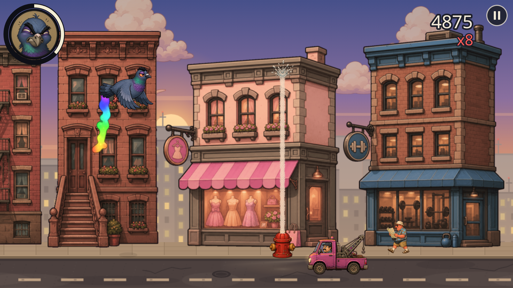
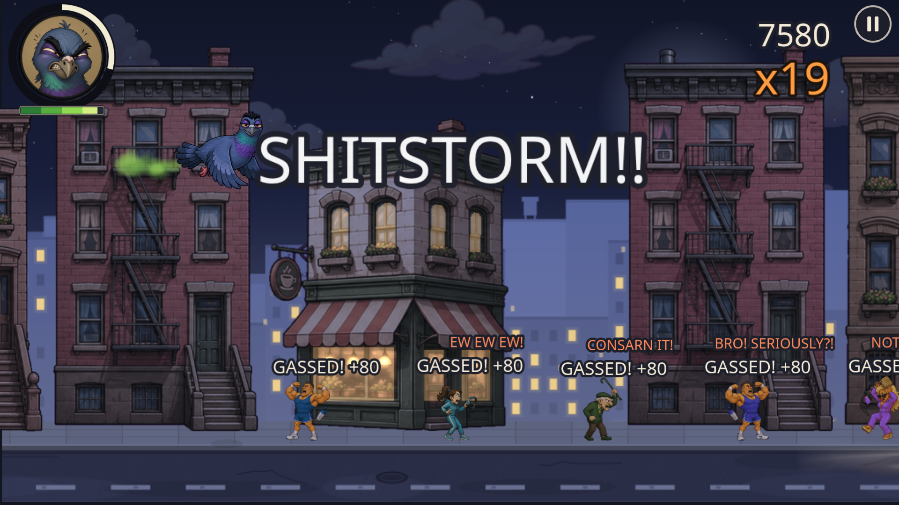
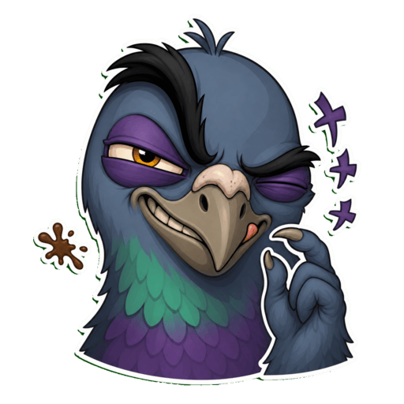

<h1 align="center">
   
  Pigeon Drop
</h1>

  Ever received a "gift" from a pigeon? 
  On your hat? May be on your car? 
  Ever wanted to become that pigeon? 
  Now you can - at <a href="https://pigeondrop.me"><b>https://pigeondrop.me</b></a>

  <a href="https://www.youtube.com/watch?v=Zs-UI1OGvxM">
     
    ▶&nbsp;<b>Watch the video</b>
  </a>

A game where you are a pigeon painting your art on the streets,
cars and irritating bypassers.  
Being creative with what you eat allows you to modify what you produce and irritate everybody even more! Just steer clear of fire hydrants!

Technically - browser-based game with the possibility to register as Progressive Web App.

  
  

##  How we built it
Built with Phaser 3 as an engine, in Typescript with GLSL Shaders.
Powered by Codex and ChatGPT 5.6 all the way:
- GPT 5.6 Sol used for architecture and mechanics
- GPT 5.6 Terra for routine coding and interaction with asset generation (pictures also done in Codex!)
- GPT 5.6 Luna for tool calls, such as running game with playwright for verification, deployment etc.

Used 3 core skills for consistent reuse:
- `/run-game`
- `/game-art`
- `/audio-gen`  
More were transitory

Also deployed to GhatGPT Sites:
https://pigeon-drop.aadodonov.chatgpt.site/

##  Challenges we ran into
A small game normally needs months and a team: concept artist, developer, designer, animator. I had just me - a developer, and not a game developer at that. So that's why it stayed an idea for 10 years.
I could overcome those with Codex, effectively getting 10x speed up.
Honest challenges even with Codex:
- No (easy) possibility to sync between CLI and Desktop ChatGPT app
- No direct sound asset generation
- For consistency constant care of skills is needed
 

##  Accomplishments that we're proud of
I finally shipped what I wanted to for 10 years.  
Hundreds of sprites. Tens of sound effects. Thousands of lines of code.  
Shipped in 1 week by just me. And Codex, duh.   
And, of course, neverending fun!  
P.S. And it's ready to play! Both via ChatGPT Sites and my custom domain.
Optimized for both PC and mobile.

## What we learned
Codex can do much more than coding. Assets, tools call, you name.  
Still, building proper pipelines does require human-in-the-loop, and for many things - from defining and proactively sharpening `skill`s, to artistic taste.

##  What's next for Pigeon Drop
- More districts to "decorate", mechanics, pigeon victims
- Proper levelling
- Getting audience
- Ports
- More fun!
- More Codex!
